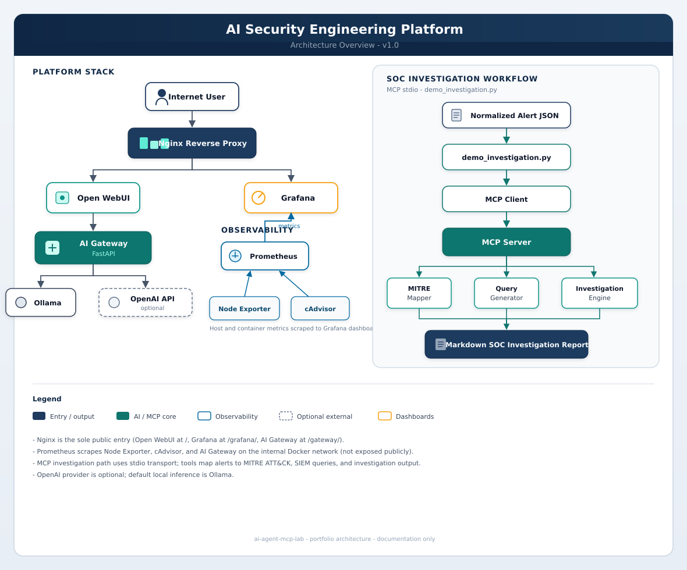
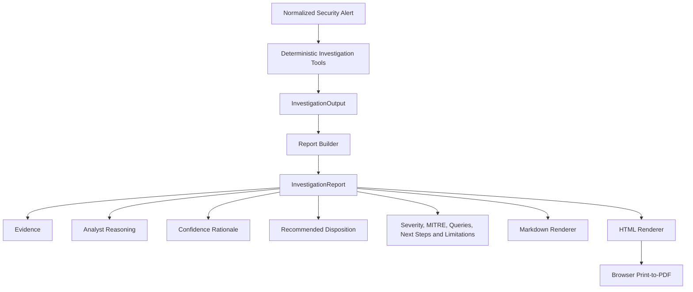

# AI Agent MCP Lab


An offline, deterministic AI-assisted SOC investigation platform that converts normalized security alerts into evidence-grounded analyst reports with structured evidence, analyst reasoning, confidence rationale, recommended disposition, hunt-query drafts, and portable Markdown and HTML outputs with browser print-to-PDF support.

The lab does **not** connect to live SIEM or EDR systems, does **not** perform automated response, and always requires human analyst review. Investigation outputs are reproducible from the same sample inputs. MCP tools expose the investigation workflow; the AI Gateway and local-model paths are separate supporting components for chat and prompt evaluation—not silent drivers of report conclusions.

This project is educational and portfolio-oriented. It is not production-ready and does not independently determine true positives.



## Key Capabilities

- Deterministic alert investigation from normalized JSON
- Structured evidence with traceable `EVID-###` IDs
- Evidence-based analyst reasoning
- Confidence rationale (supporting and limiting factors)
- Conservative recommended disposition (`Suspicious Activity` / `Insufficient Evidence`)
- Analyst review required on every report
- MITRE ATT&CK mapping for supported alert types
- Query generation for supported platforms (AQL, KQL, DQL)
- Markdown and standalone HTML reports from the same `InvestigationReport`
- Browser print-to-PDF (no separate PDF renderer)
- MCP investigation tools over stdio
- Offline sample workflows
- Prompt evaluation and local-model experimentation (separate from report conclusions)

## Architecture

Normalized alerts flow through deterministic investigation tools into a structured report, then into Markdown and HTML renderers. PDF is a browser export of the HTML.



Investigation and report-support modules use deterministic logic and templates. The AI Gateway, Ollama, and prompt evaluation paths are separate experimentation components and do not silently alter report conclusions.

The self-hosted platform stack (Nginx, Open WebUI, AI Gateway, Prometheus, Grafana) runs alongside the offline MCP investigation path. Full platform diagram: [docs/images/architecture-overview.svg](docs/images/architecture-overview.svg).

## Demo Gallery

Four fictional scenarios demonstrate the investigation and reporting pipeline:

| Scenario | HTML | Notes |
| -------- | ---- | ----- |
| [SSH Failed Login](docs/demo-output/ssh-failed-login-investigation.html) | Full HTML | [PDF sample](docs/demo-output/ssh-failed-login-investigation.pdf) |
| [Phishing Email](docs/demo-output/phishing-email-investigation.html) | Full HTML | — |
| [Suspicious Process](docs/demo-output/suspicious-process-investigation.html) | Full HTML | — |
| [Insufficient Evidence](docs/demo-output/insufficient-evidence-investigation.html) | Full HTML | Conservative disposition |

[Full Demo Gallery — index](docs/demo-output/README.md)

GitHub may display raw HTML source; open the files locally in a browser for the intended offline presentation.

## Example Report

Primary sample: [SSH Failed Login — HTML](docs/demo-output/ssh-failed-login-investigation.html) · [PDF](docs/demo-output/ssh-failed-login-investigation.pdf)

Each report includes Investigation Status, Executive Summary, Evidence, Analyst Reasoning, Confidence Rationale, Recommended Disposition, severity, MITRE, hunt queries, next steps, and limitations—derived from one `InvestigationReport` object.

## Quick Start

```bash
git clone <repository-url>
cd ai-agent-mcp-lab/platform
cp .env.example .env
docker compose --profile mcp build mcp-server
```

For the **isolated MCP investigation demo**, you only need the `mcp` profile and the built image. No live SIEM credentials are required.

For the **full platform stack** (Nginx, Open WebUI, Prometheus, Grafana), set `GRAFANA_ADMIN_PASSWORD` in `platform/.env` before `./scripts/deploy.sh`. Gateway chat also needs `GATEWAY_API_KEY` when using the AI Gateway.

Compact investigation (JSON to stdout):

```bash
docker compose --profile mcp run --rm mcp-server \
  python main.py sample_data/ssh_failed_login.json --compact
```

Generate Markdown and HTML:

```bash
docker compose --profile mcp run --rm \
  -v "$(pwd)/../docs/demo-output:/output" \
  mcp-server \
  python demo_investigation.py \
    sample_data/ssh_failed_login.json \
    -o /output/ssh-failed-login-investigation.md \
    --html-output /output/ssh-failed-login-investigation.html
```

Helper scripts and Compose profiles: [platform/README.md](platform/README.md).

## MCP Tools

The offline platform MCP server (`platform/mcp-server`) exposes:

- `investigate_alert`
- `map_mitre`
- `generate_queries`

An extended workstation catalog (`scripts/soc_mcp_server.py`) also includes tools such as `investigate_security_incident`, `correlate_security_events`, `generate_investigation_runbook`, `review_investigation_decision`, `generate_splunk_spl`, and `enrich_observable`.

Detail: [platform/mcp-server/README.md](platform/mcp-server/README.md).

## Report Outputs

All report content derives from the same `InvestigationReport`.

### Markdown

Portable, reviewable in Git, suitable for tickets and documentation.

### Standalone HTML

Embedded CSS, no JavaScript, no external assets, offline, and print-friendly. Authoritative source for browser presentation.

### PDF

Generated through browser print-to-PDF from the HTML report. There is no independent PDF renderer in the service. One committed SSH sample is included under `docs/demo-output/`.

## Testing

Validated report suite:

```text
138 report tests
41 HTML renderer tests
179 total
```

Also validated for Version 1.1 gallery readiness:

- Docker MCP build
- Demo investigation (Markdown + HTML)
- Compact CLI for all four gallery inputs
- MCP client smoke test
- Four gallery sample inputs and expected dispositions

Do not treat this as measured code coverage or live vendor integration testing.

## Design Principles

- Evidence first
- Deterministic conclusions
- Traceable references
- Conservative disposition vocabulary
- Analyst-in-the-loop
- Offline-first samples
- Separation of investigation and presentation
- No hidden automated response

## Technology Stack

### Application

- Python
- FastAPI
- Pydantic
- Model Context Protocol

### AI and evaluation

- Ollama
- OpenAI-compatible AI Gateway
- Promptfoo
- Open WebUI

### Security investigation and reporting

- MITRE ATT&CK
- QRadar AQL
- Microsoft Sentinel KQL
- Microsoft Defender Advanced Hunting KQL
- OpenSearch DQL
- Markdown
- Standalone HTML
- Browser print-to-PDF

### Infrastructure and observability

- Docker Compose
- Nginx
- Prometheus
- Grafana
- Node Exporter
- cAdvisor

## Security and Privacy

- Demo data is fictional (documentation IP ranges and example domains)
- HTML escapes report-derived content
- HTML contains no JavaScript or external assets
- Normal report generation requires no external network access
- `.env` is ignored; secrets must not be committed
- Analyst review remains required
- No automated remediation or containment occurs

## Limitations

- Uses normalized sample alerts
- No live SIEM, EDR, email, or cloud connectors
- Query and MITRE recommendations require analyst validation
- No automated containment, remediation, or closure
- Analyst review is required
- PDF export is browser-based
- The project is educational and portfolio-oriented
- Small local models may provide limited output quality
- External AI providers are optional and configuration-dependent

## Roadmap

Future work (post–Version 1.1; not release blockers):

- Investigation timeline model
- Additional alert types
- Optional human-approved live connectors
- Optional batch PDF generation if needed
- Broader prompt and provider evaluation
- CI and release automation
- HTTPS and observability improvements

## Documentation

| Document | Purpose |
| -------- | ------- |
| [docs/demo-output/README.md](docs/demo-output/README.md) | Demo gallery index and regeneration |
| [PROJECT_CONTEXT.md](PROJECT_CONTEXT.md) | Architecture, status, and handoff context |
| [platform/README.md](platform/README.md) | Platform ops, profiles, and quick commands |
| [platform/mcp-server/README.md](platform/mcp-server/README.md) | MCP tools, CLI, and gallery commands |
| [platform/docs/architecture.md](platform/docs/architecture.md) | Component and traffic-flow detail |
| [platform/docs/platform-blueprint.md](platform/docs/platform-blueprint.md) | Security model and longer roadmap |
| [platform/docs/prompt-library.md](platform/docs/prompt-library.md) | SOC prompt templates |
| [platform/docs/promptfoo.md](platform/docs/promptfoo.md) | Prompt evaluation setup |
| [CHANGELOG.md](CHANGELOG.md) | Notable changes |

## Author

Sydney McGee

Cybersecurity Analyst · Security Automation · AI Security Engineering
